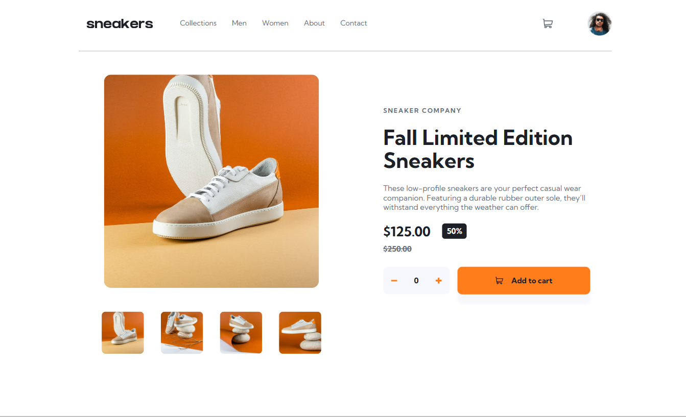

# 📦 E-commerce product page

Esta es una solución al [desafío de e-commerce product page en Frontend Mentor](https://www.frontendmentor.io/challenges/ecommerce-product-page-UPsZ9MJp6). Los desafíos de Frontend Mentor ayudan a mejorar tus habilidades de programación creando proyectos realistas.

## 📁 Tabla de contenido

- [Descripción general](#descripcion-general)
  - [Captura de pantalla](#captura-de-pantalla)
  - [Links](#links)
- [Mi proceso](#mi-proceso)
  - [Llevado a cabo con](#llevado-a-cabo-con)
  - [Lo que aprendí](#lo-que-aprendi)
- [Autor](#autor)
- [Agradecimientos](#agradecimientos)

## 🔎 Descripción general

### 📷 Captura de pantalla

### 🔗 Links
- [URL de la solución](https://www.frontendmentor.io/solutions/men-navegable-de-pgina-web-html-y-css-vUgVs_SLAZ)
- [URL del sitio en vivo](https://braismarquez2025.github.io/social-links-profile-main/)

## 👤 Mi proceso
Proyecto centrado en la parte de frontend, no he querido hacerlo con django ya que creo que este proyecto está pensando para hacerlo de esta manera, pero no tendría problema en implementar django y añadir urls a la página, donde podría crear la página para el checkout y tener una base de datos con más productos. 

### 🔧 Llevado a cabo con
- HTML
- SCSS
- JavaScript
- GitHub Pages

### 💡 Lo que aprendí
El desarrollo de este proyecto me ha servido para aprender a hacer una galería estática (al clicar sobre la imagen del producto en vista desktop) y mejorar mis conocimientos frontend, ya que hay partes del proyecto que las desarrollo con mucha fluidez, como crear el index.html o el menú lateral, y otras donde tengo que informarme un poco a la hora de hacerlas, pongo el ejemplo de la galería estática.

### ✌️ Autor 
- 💼 GitHub - https://github.com/braismarquez2025
- ✉️ Gmail - braismarquez2003@gmail.com
- 👤 Usuario de Frontend - [@braismarquez2025](https://www.frontendmentor.io/profile/braismarquez2025)

